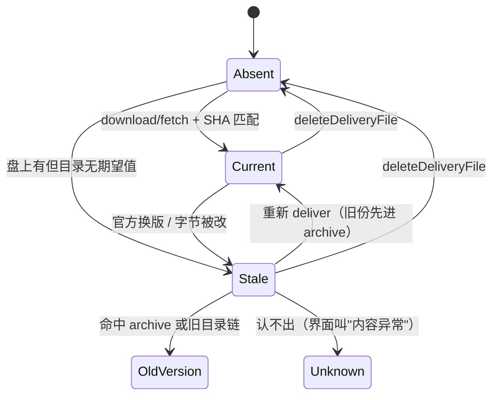
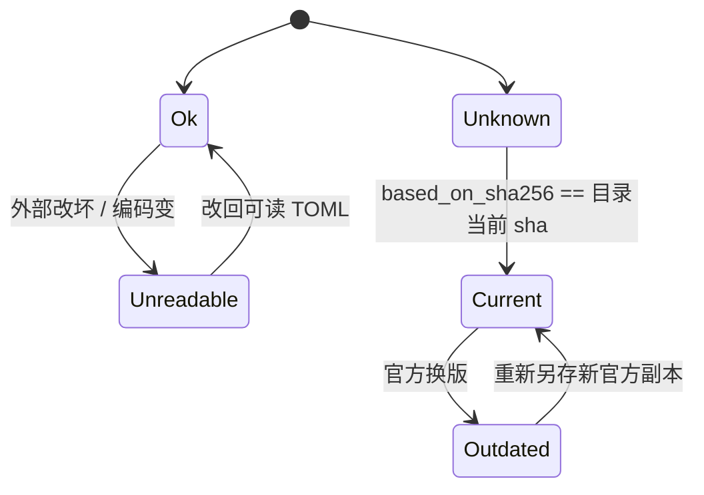
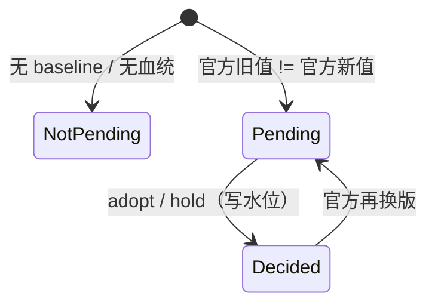
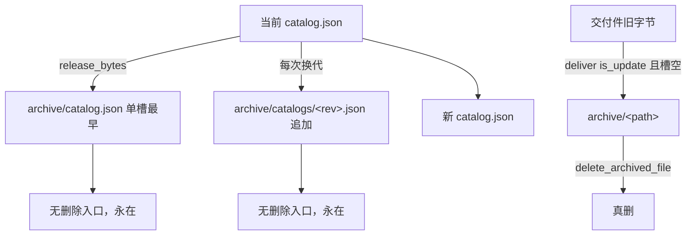

# 02 · 领域与状态层：还原真实数据模型

> 这一层是本次审计的核心。**状态不能凭产品理想设计推测，必须还原当前实现。**
> 每条都给 `路径::符号::行号` 与证据等级。

## 0. 数据根与路径

| 项 | 值 | 证据 |
| --- | --- | --- |
| 内部根 | `<appDataDir>`（自动建 `cloud/ archive/ logs/ run/`） | `src-tauri/src/fsx/paths.rs::internal_root::43` |
| 用户根 | `<appDataDir>/user`（自动建 `exports/ reports/ presets-mine/`） | `src-tauri/src/fsx/paths.rs::user_root::56` |
| 防穿越唯一实现 | `resolve_in`（三道闸）+ `check_relative` | `src-tauri/src/fsx/paths.rs::78`、`::112` |
| 交付落点唯一出口 | `root.join(catalog.path)` | `src-tauri/src/runtime/paths.rs::released_file::50` |
| 用户根不落 Documents | 有源码扫描判据钉住 | `src-tauri/src/fsx/paths.rs::the_user_root_never_touches_documents::212` |

> 注意：`catalog.path` 既是"云端取哪"也是"本机放哪"（唯一路径语义）。**没有第二套路由。**

## 1. 实体档案（18 个）

字段含义：**标识 / 落点 / 权威字段 / 派生字段 / 与谁相关**。「副本与冲突」一栏只写真实存在的重复表达。

### 1.1 配置与目录

**E-01 官方源配置 `presetSource`**（setting）
- 含义：本机去哪取预设数据（github / gitee / custom）。
- 标识：single。落点：`run/app-state.json#presetSource`。格式：JSON `PresetSource{sourceSchema,mode,customUrl?,shape?}`，schema=2。
- 创建/改：`app_state.rs::set_preset_source::394`（命令 `ipc/catalog.rs::set_preset_source::130`，**先探一次网络再落盘**）。
- 读：`app_state.rs::preset_source::389`。删：`clear_preset_source::402`（无界面调用者）。
- 权威：`mode` / `customUrl`。派生：`shape`（探测出来的 CustomShape，是缓存）。
- 冲突/损坏：坏档报 `CORRUPTED`，不静默。旁白：旧 `run/preset-source.json` 已退役（读侧兜底、写成功后删）。
- 证据：`src-tauri/src/runtime/source.rs::26`。

**E-02 运行时目录 `catalog.json`**（data）
- 含义：首屏唯一数据源（机型/版本/参数注册表/资产/套餐/打印板/交付文件清单）。
- 标识：`revision`（对 brands+machines+assets+bundles+registry+plates+files 稳定序列化取 SHA256 前 16 位；**不含** revision 自身、publishedAt、structureSignature）。
- 落点：`<appDataDir>/catalog.json`。格式：JSON `Catalog{catalogSchema,revision,publishedAt?,brands,machines,assets,bundles,registry,plates,files,structureSignature,minClientVersion?}`。
- 创建：`release.rs::ensure_released::102`（启动**只补空位**）、`release::release_bytes::121`（OTA 换代）。
- 读：`runtime/mod.rs::load_released_catalog::100`。写：`apply_remote_update`。删：无入口（手删）。
- 权威：`files[]`、`revision`、`publishedAt`、`structureSignature`。派生：`CatalogFile.sha256/size`（发布侧对产物真字节算；对盘上字节是**期望值**）。
- 副本：旧目录在 `archive/catalog.json`（单槽最早）+ `archive/catalogs/<rev>.json`（版本链）。
- 损坏：`Catalog::parse::312` 报 CORRUPTED；能力判定 `structure::can_read::456`（先能力后版本）。
- 证据：`src-tauri/src/runtime/catalog.rs::56`、`src-tauri/src/runtime/release.rs::102`。

**E-17 机型 / 版本 / 套餐 / 配方 / 资产 / 打印板**（embedded）
- **全部内嵌在 catalog.json**，无独立落盘、无用户状态。机型图/版本图按 asset id 引用；资产交付落点 `dest_of_asset::262`。
- 前端在旧后端缺字段时有 `useParams.ts::678` 的兜底分支。
- 证据：`src-tauri/src/runtime/catalog.rs::56`、`::262`。

### 1.2 官方侧字节

**E-03 官方原件（下载区交付文件）**（file）
- 含义：从官方源取回的字节，落在 `catalog.path`（如 `delivery/mkp/presets/*.toml`）。
- 标识：`fileName`（目录键）+ 字节 sha256。落点：`<appDataDir>/<catalog.path>`。
- 创建/改：`delivery.rs::deliver::184`（取回 → 校验 → 防穿越 → 归档旧份 → 原子写）。
- 读：`file_status::107`、`official_text::737`（SHA 闸）、`downloaded_entries::866`。
- 删：`delete_downloaded::540`（幂等；连带撤指针/草稿/备注）。
- 权威：盘上字节。副本：归档区可能有旧字节。损坏：SHA/大小不符 → 整批拒绝、不落盘。
- 证据：`src-tauri/src/runtime/delivery.rs::184`。

**E-04 归档区 `archive/<catalog.path>`**（file）
- 含义：官方换版时被换下的旧字节；**保留最早一份、不覆盖**。属于官方版本生命周期，**不是**用户修改历史。
- 创建：`deliver::220-234`（仅 is_update 且槽位为空时）。读：`archived_files::474`。删：`delete_archived::560`（真删；版本链与事件账不动）。
- 证据：`src-tauri/src/runtime/delivery.rs::474`。

**E-05 目录记忆（单槽 + 版本链）**（data）
- 含义：本机见过的历次目录 —— 「这份旧字节属于官方哪一版」的唯一证据来源。
- 落点：`archive/catalog.json`（最早一份）+ `archive/catalogs/<revision>.json`（每次换代追加）。
- 创建：`release_bytes::131-169`。读：`official_versions::56`、`generation_index::305`、`other_known_versions::621`。
- 删：**无入口**（`delete_archived` 只删交付字节）。
- 证据：`src-tauri/src/runtime/release.rs::121`、`src-tauri/src/runtime/versions.rs::56`。

**E-09 隐藏基准 `baseline/<sha256>.toml`**（file）
- 含义：每一版下载过的官方预设正文快照；服务「官方旧值 / 恢复默认」的三方对照。
- 标识：`<sha256>.toml`（sha 即内容，按内容寻址、幂等、不覆盖）。落点：`<appDataDir>/baseline/`。
- 创建：`deliver::252`（kind==PRESET 时，sha = 下载字节全文 sha256）、`ipc/param_sync.rs::local_official_text::375`（读官方当前版时顺手补）。
- 读：`read_baseline::108`（字节与文件名不符当没有::120-124）。删：**无 GC（设计）**。
- 权威：正文摘要。**不参与「新/旧版本」判定**。
- 证据：`src-tauri/src/runtime/baseline.rs::52`、`::90`、`::120`。

**E-13 事件账 `preset_events.json`**（data）
- 含义：交付字节的「下载 / 替换」事件时刻 —— 界面时间的**唯一**业务来源（mtime 已退役）。
- 格式：`{schema, events:[DeliveryDownloaded{file,sha256,revision?,at} | DeliveryReplaced{file,old_sha256,…}]}`。
- 创建：`append::134`（只追加）；`bootstrap_events::382` 首次建账（从 mtime 补，**有损**）。读：`arrival_of::155`、`replaced_at_of::178`。删：**无**。
- 证据：`src-tauri/src/runtime/preset_events.rs::104`、`src-tauri/src/runtime/delivery.rs::382`。

**E-18 软件发布信息 `release.json`**（data）
- 含义：**软件本体**的版本/说明/安装包 —— 与预设数据**完全两条链**（不进 catalog、不参与发布闸、不进结构签名）。
- 证据：`src-tauri/src/runtime/release_info.rs::10`。

### 1.3 用户侧

**E-06 用户工作副本 `presets-mine/…`**（file）
- 含义：用户世界里唯一可见、可改、可用的那一份预设（官方那份是只读模板）。
- 标识：相对用户根路径。格式：TOML + 文件头注释（归属两行 + 血统三行）。
- 创建：`commit_draft::399`（官方→我的另存）、`save_back::433`（写回自己）、`save_official_as_new::756`（取回时落一份）、`copy_as_new::703`、`import::commit::180`。
- 读：`mine_files::278`（扫盘）、`read_preset_text::498`。改：`write_text::519`、`save_back`、`set_machine_variant::463`、`rename_file::651`。
- 删：`delete_file::791`（**真删**，无垃圾桶、无归档）。
- 权威：盘上字节 + 文件头三行。派生：`state`（可读性）、`basedOn`、`machineId/versionId`（头两行归一化，缺失回落血统）。
- 损坏：读不出 → `MineState::Unreadable`，禁止 apply/edit，但照常列出。
- 证据：`src-tauri/src/runtime/mine.rs::278`、`::756`、`::791`。

**E-07 编辑草稿 `draft`**（runtime）
- 含义：「改到一半关掉也还在」的临时正文（全局最多一份）。落点：`run/app-state.json#draft`。
- 字段：`origin / fileName / path / sourceSha256（打开那一刻的来源指纹）/ text / updatedUnix`。
- 创建/改：`set_draft::279`（命令 `begin_preset_edit::247`、`put_preset_draft::351`、`patch_preset_draft::374`）。读：`draft::274`。删：`clear_draft::301`。
- 证据：`src-tauri/src/runtime/app_state.rs::279`。

**E-08 使用中指针 `activePreset`**（runtime）
- 含义：「现在生效的是哪一份」——全局唯一。**只切指针，不复制文件。**
- 字段：`origin(official|mine) / fileName / sha256（应用时刻指纹）/ path? / machineId / versionId / intact（派生）`。
- 创建：`set_active_official::220` / `set_active_mine::245`（命令 `apply_active_preset::889`）。读：`active_preset::214`、`state::active_matches_disk::125`。删：`clear_active_preset::264`（**界面无入口**，"撤销应用"2026-10-04 退役）。
- 证据：`src-tauri/src/runtime/app_state.rs::220`、`src-tauri/src/ipc/catalog.rs::889`。

**E-10 逐参数决策账 `paramDecisions`**（runtime）
- 含义：「这一项我处理到哪一版官方」的水位（`adopt` 采用 / `hold` 保持）。
- 结构：`presets-mine 相对路径 → 参数 key → {kind, sha256}`。落点：`run/app-state.json#paramDecisions`。
- 创建/改：`record_param_decisions::361`（合并写；命令 `apply_preset_param_decisions::127`）。读：`param_decisions::349`。
- 删：`forget_param_decisions::379`（删用户文件时）、改名随 `repoint_mine::339`。
- 关键：**参考版 = `decisions[key].sha256 ?? based_on_sha256`**（`runtime/param_sync.rs::96`）—— 这句是"我上次处理到哪一版"的全部实现。
- 证据：`src-tauri/src/runtime/app_state.rs::361`、`src-tauri/src/runtime/param_sync.rs::96`。

**E-11 备注覆盖账 `user/preset-remarks.json`**（data）
- 含义：用户改过的列表副标题（**空串也是覆盖**）。键：官方行 `catalog.path` / 用户行相对路径。
- 写：`remarks::set::56`（命令 `set_preset_remark::736`）。删：`remove::79`。回落链：账 → `catalog.remark` → 空着。
- 证据：`src-tauri/src/runtime/remarks.rs::33`。

**E-12 出处账 `user/provenance.json`**（data）
- 含义：「这份是从哪一份用户文件复制来的 / 是不是导入的」。
- 结构：`Entry{to,from?,kind(copy|import),at,schema}`。写：`record::85`（`commit_import` 里用 `let _ =` **吞错**）、改名 `repath::110`。
- 权威：**只是历史事件**；盘上不存在，"复制自谁"丢了就没了。坏档 = 空表。
- 证据：`src-tauri/src/runtime/provenance.rs::69`、`src-tauri/src/ipc/import.rs::94`。

### 1.4 内嵌在文件里的两套注释

**E-15 文件头血统**：# based_on / # based_on_release_time / # based_on_sha256
- 写：`lineage.rs::make_copy::102`、`rewrite_keeping_lineage::125`。读：`parse_lineage_from_content::263`、`mine.rs::based_on::179`。
- 权威：来源关系。`based_on_sha256` 与 baseline 的键**同域**（这是"官方旧值"能查到的原因）。
- 证据：`src-tauri/src/runtime/lineage.rs::63`。

**E-16 文件头归属**：# machine: / # variant:
- 写：`rewrite_machine_variant::339`（命令 `set_user_preset_machine_version`）。读：`owner_of`（列表两列 / 校准匹配）。
- 权威：**文件自己的归属**（与血统来源的机型/版本是两件事）。认不出则回落血统，仍认不出 → 「未标机型」。
- 证据：`src-tauri/src/runtime/lineage.rs::339`。

### 1.5 派生（不是实体）

**E-14 官方版本清单**：**无独立落盘**，每次由 `versions::official_versions::56` 把当前目录 + 版本链按 `(fileName, sha)` 去重算出。
- 注意：`downloaded = baseline_exists`（`ipc/preset_baseline.rs::67`）—— **与"磁盘上有没有"是两套口径**（见 §4 冲突）。

## 2. 状态机（4 个）

### SM-01 下载区官方件（四态）

| 状态 | 判定 | 保存 | 证据 |
| --- | --- | --- | --- |
| Absent 未下载 | `file_status::108` 读失败 / 目录登记但盘上无 | 盘（不存在） | `delivery.rs::107` |
| Current 已下载 | `status_of::115`：盘上 sha == 目录期望值 | 盘 | `delivery.rs::115` |
| Stale 不一致 | 盘上有但与目录期望值不同 | 盘 | `delivery.rs::115` |
| OldVersion 旧版本 | `trust_of::699` 命中 `other_known_versions::621` | 盘 + 目录链 | `delivery.rs::699` |
| Unknown 内容异常 | 对不上任何已知版本 | 盘 | `delivery.rs::714` |

- 失败态：SHA/大小不符 → 整批拒绝、**不碰盘**（`sha_mismatch_error::129` 按 revision 是否不同分两种说法）。
- 能从盘重算：**能**（sha + 归档 + 目录链）。
- 没有任何入口能处理的状态：无。

### SM-02 用户工作副本（可读性 × 血统）

| 状态 | 判定 | 证据 |
| --- | --- | --- |
| Ok 可读 | UTF-8 + TOML 可解析 | `mine.rs::preset_file_state::255` |
| Unreadable 读不出 | 读失败 / 非 UTF-8 / 语法错 / 软链越界 | `mine.rs::310` |
| BasedOn::Current | `based_on_sha256 == 目录当前 sha` | `mine.rs::196` |
| BasedOn::Outdated | 两者都有值且不等 | `mine.rs::196` |
| BasedOn::Unknown | 无血统 / 来源不在目录（随包 bootstrap 无期望值也落这里） | `mine.rs::202` |

- 失败态：Unreadable → 不许 apply/edit，但**照常列出**。
- 能从盘重算：能（扫盘 + 头注释 + 目录）。

### SM-03 baseline + 逐参数决策

| 状态 | 判定 | 证据 |
| --- | --- | --- |
| 永不 pending | baseline 缺失（`official_old=None`）或没有血统 | `param_sync.rs::97` |
| pending | 官方旧值 ≠ 官方新值（`diff::103`） | `param_sync.rs::103` |
| decided | 水位（`decisions.sha256 ?? based_on_sha256`）== 官方当前版（`::109`） | `param_sync.rs::109` |

- 失败态：adopt 时官方正文不在本机 → **如实报错**，不许"记了水位、值却没写"。
- 不可重建：水位账（"我处理到哪版"盘上不存在）；baseline 可按内容重下。
- **没有任何入口能处理的状态**：baseline 缺失导致的"永不 pending" —— 合法但无动作。

### SM-04 目录与目录记忆

- 读不懂 → **盘零改动** + `NOT_SUPPORTED`（前端 `checkBootstrapOnce` 与后端 `apply_remote_update` 各拦一道，同说一件事）。
- 证据：`src-tauri/src/runtime/release.rs::121`、`src-tauri/src/runtime/structure.rs::456`。

## 3. 预设完整生命周期（17 步）

| # | 步骤 | 命令 | 读写什么 | 成功 | 失败 | 网络 | 影响面 | 证据 |
| --- | --- | --- | --- | --- | --- | --- | --- | --- |
| 1 | 首启释放目录 | `ensure_released`（启动） | 写 `catalog.json`（只补空位） | 目录就位 | 只告警不挡启动 | 否 | 仅目录 | `lib.rs::85` |
| 2 | 检查更新 | `checkRemoteUpdate` | 读本地 catalog + 取远端 | `upToDate`/`readable` | 报错（进页面时静默） | **是** | 无 | `catalog.rs::984` |
| 3 | 采用新目录 | `applyRemoteUpdate` | 写 `archive/catalogs/<rev>` + `archive/catalog.json` + `catalog.json` | 新目录生效 | 读不懂 → 盘零改动 | **是** | 改目录 + 版本链 | `catalog.rs::1012` |
| 4 | 下载一份官方预设 | `downloadCatalogFile(s)` | 取回 → 校验 → 归档旧份 → 原子写 → baseline → 事件账 | `Current` | 校验不过 → 整批拒绝 | **是** | 官方原件变、旧份归档 | `catalog.rs::246` |
| 5 | **取回官方预设**（下载/更新） | `fetchOfficialPreset` | ①`ensure_official_bytes` ②`save_official_as_new` | 官方字节落地 + 我的一份落地 | 两步串行；第二步失败整条报错（**无回滚**） | 仅当盘上缺/不符 | 官方原件可替换；已有我那份**一字节不动** | `catalog.rs::434` |
| 6 | **「使用」** | `applyActivePreset` | **只写 `run/app-state.json#activePreset`** | 指针切换 | 前置不过 → 拒绝 | 否 | **不改任何文件** | `catalog.rs::889` |
| 7 | 改这份（正文） | `beginPresetEdit` / `putPresetDraft` | 写 `#draft`（正文复制） | 草稿就绪 | 报错 | 否 | 官方原件一动不动 | `mine.rs::247` |
| 8 | 保存（官方线另存 / 用户线写回） | `commitPresetDraft` | 写 `presets-mine/<原名>（已修改）.toml`（+血统三行）/ 写回同路径 → 清草稿 | 新增 / 覆盖我那份 | 写失败原件不动；清草稿失败 → 草稿残留 | 否 | 不改官方原件、不碰指针 | `mine.rs::422` |
| 9 | 另存一份新的 | `copyUserPreset` | 字节复制 + 出处账 | 新用户文件 | 重名拒绝 | 否 | 不碰指针/草稿 | `mine.rs::532` |
| 10 | 导入外部文件 | `stageImport` → `commitImport` | 复制进 `presets-mine/` + 出处账（吞错） | 落盘 | 逐份 fail | 否 | 不碰任何状态 | `import.rs::76` |
| 11 | 改名 | `renameUserPreset` | `fs::rename` + 指针跟随 + 草稿跟随 + 出处账改路径 | 名字变、字节不动 | 撞名拒；后续账失败会**明说"文件其实已改名"** | 否 | 无内容改动 | `mine.rs::487` |
| 12 | 校准 / 参数改值 | `savePresetCalibration` / `savePresetParams` / `patchPresetDraft`+`commit` | 结构保真改写我那份（注释/键序/行尾不动） | 值更新 | 文件不在 / 项定位失败 → 原话 | 否 | 只动我那份 | `mine.rs::630` |
| 13 | 看官方更新账 | `getPresetParamSync` | 读 mine + baseline + 目录当前版（`fetchMissing` 时发一次网络） | 三方账 + `pendingCount` | 官方字节不在本机 → `officialReady=false`，新值给 `null` | 仅 fetchMissing | 只读（顺手补 baseline） | `param_sync.rs::104` |
| 14 | 落逐参数决定 | `applyPresetParamDecisions` | adopt → 改写对应项；hold → 不动；两者都写水位 | 该项退出待处理 | adopt 而官方正文不在 → 报错 | 否 | 只动我那份 + 决策账 | `param_sync.rs::127` |
| 15 | 删官方原件 | `deleteDeliveryFile` | 撤指针/草稿 + 删字节 + 删备注 | 回 Absent | 幂等（不存在=成功） | 否 | **事件账 / 归档 / baseline 不动** | `catalog.rs::746` |
| 16 | 删用户文件 | `deleteUserPreset` | 撤指针/草稿 + 真删 + 删备注 + 忘决策账 | 文件消失 | 不存在 → NOT_FOUND | 否 | 无归档、无垃圾桶 | `mine.rs::662` |
| 17 | 删归档旧版 | `deleteArchivedFile` | 真删归档字节 | 消失 | 前缀不符拒 | 否 | 版本链 / 事件账不动 | `catalog.rs::784` |

### 3.1 三条必须钉死的事实

1. **「使用」= 只切指针。** `apply_active_preset` 全程不复制文件、不生成对象（`catalog.rs::889-954`）。官方线额外做"盘上字节 == 目录 SHA"校验（`::912-923`）；用户线只做"能读 TOML"校验（`mine::read_preset_text`），**不比 SHA**。**不产生重复行、不产生重复实体。**

2. **「官方更新」链的关系**：目录换代（`release_bytes`）→ 交付件字节（`deliver`）→ 版本比较（`status_of`）→ baseline 写入（`deliver::252`，sha = 下载字节全文 sha256）→ 决策账（`app_state.paramDecisions`）→ 用户文件修改（`apply_at::441-451` 写 `presets-mine`）。
   - 三者**都幂等、互不写对方**：baseline 只被下载管道写；决策账只被 `apply_preset_param_decisions` 写；用户文件只被 adopt 项写。
   - `based_on_sha256`（文件头）在 `make_copy` 时算来源全文 sha，与 baseline 的 key 同域。
   - **副作用**：「更新」不改工作副本 ⇒ 文件头血统永停旧版 ⇒ 光凭血统，云端行会一直显示"有新版"。这就是 X-10 的由来。

3. **「删除」与「归档」各删什么**：
   - `deleteDeliveryFile`：删官方交付字节 + 撤指针/草稿 + 删备注；**留** baseline + 事件账 + 归档。
   - `deleteArchivedFile`：删归档字节；**留**版本链 + 事件账。
   - `deleteUserPreset`：**真删**（无归档、无垃圾桶）+ 删备注 + 忘决策账。
   - 归档**只在 `deliver` 的 is_update 分支产生**（`delivery.rs::220-234`）。

## 4. 数据权威与读写矩阵

| 数据 | 权威来源 | 读者 | 写者 | 派生？ | 用户可见？ |
| --- | --- | --- | --- | --- | --- |
| `catalog.json` | 磁盘（发布产物） | 全部读命令 | `ensure_released`（只补空位）、`apply_remote_update` | 否 | 间接 |
| 官方原件字节 | **磁盘** | `file_status` / `official_text` / `downloaded_entries` | `deliver`（下载） | 否 | 是（状态列） |
| 归档旧字节 | 磁盘 | `archived_files` | `deliver`（is_update） | 否 | 是 |
| 目录记忆 | 磁盘 | `official_versions` / `generation_index` / `other_known_versions` | `release_bytes` | 否 | 间接 |
| 用户工作副本 | **磁盘** | `mine_files` / `read_preset_text` | `commit_draft` / `save_back` / `save_official_as_new` / `copy_as_new` / `import` / `write_text` / `set_machine_variant` / `rename_file` | 否 | 是 |
| 编辑草稿 | `run/app-state.json` | `app_state.draft` | `set_draft` / `clear_draft` | 否 | 是 |
| 使用中指针 | `run/app-state.json` | `appState.ts`（唯一订阅口） | `set_active_official` / `set_active_mine` / `clear_*` | 否 | 是 |
| baseline | 磁盘（按内容寻址） | `param_sync` / `preset_baseline` | `ensure_baseline` | 否 | 否 |
| 逐参数决策账 | `run/app-state.json` | `param_sync` | `record_param_decisions` | 否 | 间接 |
| 备注覆盖 | `user/preset-remarks.json` | 本地表副标题 | `set_preset_remark` | 否 | 是 |
| 出处账 | `user/provenance.json` | 来源格 | `copy_user_preset` / `commit_import` / `rename_user_preset` | 否 | 是 |
| 事件账 | `preset_events.json` | `arrival_of` / `replaced_at_of` | `deliver` | 否 | 是（时间列） |
| 血统 / 归属 | **文件头（随文件走）** | `based_on` / `owner_of` | `commit_draft` / `save_back` / `set_machine_variant` | 否 | 是 |
| 官方版本清单 | **派生**（目录 + 版本链 + baseline） | `presetTree.cloudRows` | — | **是** | 是 |
| 行状态（四态 / 三态） | **前端派生**（catalog + 盘上三读 + baseline + 血统） | `PresetTable` | — | **是** | 是 |
| 本机已下载（旧口径） | **桩** `get_local_files` 恒空 | 预设页计数 / 树 / `statusOf` | — | 否 | 是（**恒 0**） |
| 已复制到切片器 | **桩** `get_slicer_copied` 恒空 | 切片器行「已复制」 | — | 否 | 是（**恒未复制**） |
| 置顶 / 搜索词 / 抽屉宽 / BBS 4 偏好 | localStorage（纯偏好） | 各页 | 各页 | 否 | 是 |

> **多写者注意**：用户工作副本有 8 个写者（上表第 5 行），它们**互不重叠**（各自负责不同动作），但没有任何锁或版本号保护并发；靠"写前校验 + 原子写 + 幂等"兜住。

## 5. 状态组合与冲突（逐条核实）

| id | 情况 | 真实存在？ | 说明 | 证据 | 等级 |
| --- | --- | --- | --- | --- | --- |
| CF-01 | **「已下载」两套口径** | **是** | `OfficialVersion.downloaded = baseline_exists`；而 `delete_delivery_file` 不删 baseline ⇒ 删了字节后云端表仍可能显示"已下载"，`get_downloaded_files` 走磁盘却说没有 | `preset_baseline.rs::67`、`catalog.rs::766`、`delivery.rs::834` | 已发现冲突 |
| CF-02 | 「本机已有」三处表达互不同步 | **是** | 磁盘 `file_status` / baseline / 事件账，再加前端两处（`get_local_files` 桩、release 行读下载区） | `delivery.rs::107`、`preset_baseline.rs::67`、`presets.rs::812` | 已发现冲突 |
| CF-03 | 目录外的字节根本不列 | **是** | `stale_entries::872` 只遍历 `catalog.files`；内部根里目录没登记的文件既不报错也不列出（不会当孤儿） | `delivery.rs::872` | 已证实 |
| CF-04 | 工作副本存在但血统丢失 | **是（被当合法）** | 导入的 / 手工拷的都这样；界面说"说不清" | `mine.rs::180`、`::202` | 已证实 |
| CF-05 | 官方换了版但本地可能没有明确更新状态 | **是** | 仅当 `based_on_sha256` 与目录当前 sha 都有值且不等才判 `Outdated`；随包目录无期望值 → `Unknown` | `mine.rs::202` | 部分证实（设计有意） |
| CF-06 | baseline 与文件不匹配被静默保留 | **是** | `read_baseline::120` 字节与文件名不符当没有；`ensure_baseline` 已有则不覆盖 → 被改过的 baseline 永久不修 | `baseline.rs::120`、`::90` | 已证实 |
| CF-07 | 部分成功显示为整体失败 | **是** | `fetch_official_preset` 两步串行：官方字节已落、`save_official_as_new` 失败 → 整条报错，UI 只看得到错误，**无回滚** | `catalog.rs::450` | 部分证实 |
| CF-08 | 「已下载」口径冲突（前端两处） | **是** | 预设页/树用 `get_local_files`（恒空），release 行用下载区三态 —— 同一页两种事实 | `usePresetData.ts::596`、`presetTree.ts::448` | 已证实 |
| CF-09 | 「更新」不改工作副本 ⇒ 三态判据必须借内部信号 | **是** | 血统永停旧版，只能混入下载区 `state` 才自洽 —— 这是设计张力而非纯 bug | `presetTree.ts::2268` | 已证实 |
| CF-10 | 命令注册面两处不一致 | **是** | 客户端缺 7 条 `ipc::update::*`；工作台缺 3 条 mine 命令——**违反 lib.rs 自己写的"两份清单一字不差"** | `lib.rs::135`、`::139`、`::231` | 已发现冲突 |

### 5.1 未发现（明确说"没找到"的）

- 「归档对象仍被正常列表引用」：正常路径未发现。`other_known_versions::663` 引用的是**旧目录链里登记的 sha**（`archived_path: None`），这是设计（认得出旧版），不是孤儿。
- 「同一预设被拼成多行」：正常路径未发现（按 `(fileName, sha)` 去重）；但"同一 sha 以不同 fileName 出现"构造上没有显式防（`U-09`）。
- 「UI 显示已下载但文件已删」：**这一条实际是 CF-01**，即真实存在的冲突。
