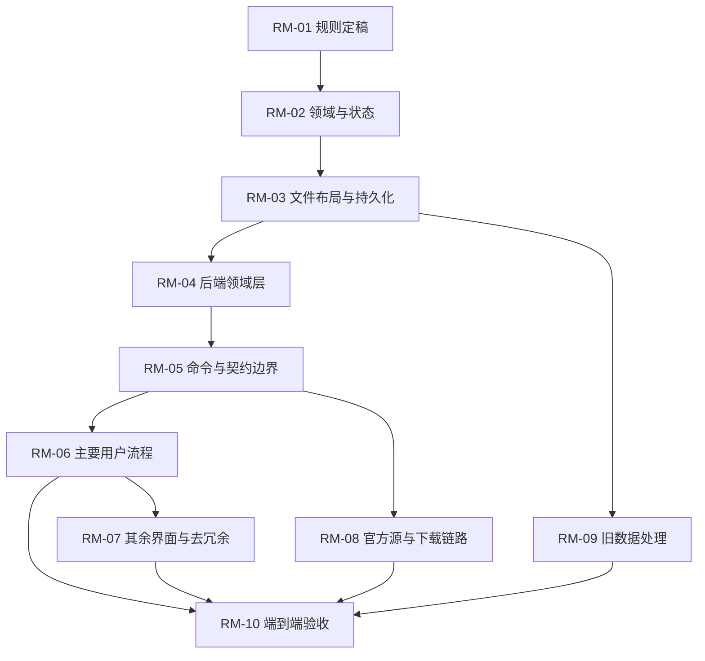

# 交付物 E · 重写任务路线图

> 顺序按**依赖关系**排（不是按重要性）。每个阶段都给：目标 / 前置 / 范围 / 关联决策 / 完成条件 / 测试要求 / 依赖 / **明确不再实现的旧机制**。
> 阶段划分刻意让**每一阶段结束时都有一件可验收的事**，而不是"完成 80%"。

## 1. 验收标准（AC-01 ~ AC-12）

重写完成的判据。每条都能被"打开界面 / 跑一条命令 / 看一眼数据"验证。

| id | 验收标准 |
| --- | --- |
| AC-01 | 打开应用，不看源码也能说出每个页签解决什么问题；每个页签都有真实数据与动作 |
| AC-02 | 任意一个核心动作都能从界面一路追到命令、文件读写与最终状态，且这条链上**没有"点了没反应"的分支** |
| AC-03 | 「本机有没有这一份」**只有一个回答者**；删掉文件后所有界面在同一帧变"没有" |
| AC-04 | 界面文本中**不出现** baseline / 血统 / 目录指纹 / 归档 / 事件账 这些内部词 |
| AC-05 | 动作词只有「取回」与「启用」两个（不含查看类）；**不做"选一份 = 改底账"** |
| AC-06 | 任何读失败与"空"在界面上长得不一样（三态显式，**无吞错**） |
| AC-07 | 软件自更新要么在客户端构建完整可用，要么界面不摆入口（**不允许落到兜底文案**） |
| AC-08 | 命令清单由**一处定义**；有一条自动判据保证"前端会调的命令都注册了" |
| AC-09 | 写盘（含删除 / 改名 / 复制）有**覆盖 `src-tauri`** 的源码扫描判据 |
| AC-10 | 「启动零网络」「进预设页后台检查目录」「目录检查不下载文件」三条规则**各有自动判据** |
| AC-11 | 逐参数官方更新：不打开逐项列表也能完成"全部跟随 / 全部保持"，且**手改过的项永不被默认路径覆盖** |
| AC-12 | 删除正在使用的预设必须**显式确认停用**；删除其他预设不改底账 |

## 2. 路线图（10 阶段）

### RM-01 · 阶段 0：产品规则定稿

| 项 | 内容 |
| --- | --- |
| 目标 | 把本审计的 20 条裁断逐条拍板，产出一份唯一的新规则书（含"每条规则的验收怎么测"） |
| 前置 | 本审计（`README.md` + `rewrite-decisions.md`） |
| 范围 | 只写规则，不写代码 |
| 关联决策 | RD-01 ~ RD-20 |
| 完成条件 | 规则书里每条规则都有对应的验收方法；本文件 §1 的 12 条被逐条确认或改写 |
| 测试要求 | 规则书与审计裁断**一一对应**（可用本审计的 `data/rewrite.json` 做校对） |
| 依赖 | — |
| **不再实现** | 任何旧实现细节（这一阶段只谈规则） |

### RM-02 · 阶段 1：领域与状态定稿

| 项 | 内容 |
| --- | --- |
| 目标 | 确定目标实体、最小字段、状态枚举与唯一权威（把 `targetModel` 落成 schema） |
| 前置 | RM-01 |
| 范围 | 核心实体最小字段 + 四个状态枚举 + 一份权威表 |
| 关联决策 | RD-02 / RD-03 / RD-06 / RD-10 / RD-11 / RD-12 |
| 完成条件 | schema 能表达四类用户任务的每个中间态（见 §3） |
| 测试要求 | 四条用户短路路径在 schema 上可走通（写成一个 schema 级测试或评审清单） |
| 依赖 | RM-01 |
| **不再实现** | baseline 与"逐参数水位"这套中间层（改为**按项选择记录**）；归档实体 |

### RM-03 · 阶段 2：文件布局与持久化契约

| 项 | 内容 |
| --- | --- |
| 目标 | 定死目录结构与每份状态文件的位置、格式、原子性与**可重建性** |
| 前置 | RM-02 |
| 范围 | 数据根 / 用户根 / 我的预设 / 未保存改动 / 启用指针 / 官方版本记录 / 我的选择记录 |
| 关联决策 | RD-10 / RD-16 / RD-18 |
| 完成条件 | 每份状态文件都标注了"能否从磁盘重建"；写盘入口全部登记 |
| 测试要求 | 写盘扫描判据覆盖全部写/删/改名入口（含 `src-tauri`） |
| 依赖 | RM-02 |
| **不再实现** | 归档目录、`archive/catalogs/` 目录链、`preset_events.json`（合并进"官方版本记录"） |

### RM-04 · 阶段 3：后端领域层

| 项 | 内容 |
| --- | --- |
| 目标 | 实现六个用例：**取回 / 启用 / 改这份 / 保存 / 官方更新 / 删除**（一个用例一个入口） |
| 前置 | RM-03 |
| 范围 | 领域层 + 单测（每个用例的正常 / 失败 / 幂等三分支） |
| 关联决策 | RD-04 / RD-08 / RD-14 |
| 完成条件 | 六个用例单测全绿；同字节重复调用为 no-op |
| 测试要求 | 幂等测试 + "失败不半写"测试 + "删/改名/复制都过写盘判据" |
| 依赖 | RM-03 |
| **不再实现** | `copyToSlicer` / `downloadFiles` / `openModel` 的空实现；`get_local_files` 这类桩 |

### RM-05 · 阶段 4：命令与契约边界

| 项 | 内容 |
| --- | --- |
| 目标 | 命令清单由一处定义；每个"用户会问的状态"对应一个字段 |
| 前置 | RM-04 |
| 范围 | 契约 + 桥 + 一条自动判据"前端调的命令都注册" |
| 关联决策 | RD-01 / RD-06 |
| 完成条件 | 命令清单唯一；判据能拦住漂移；客户端与工作台构建都能通过自检 |
| 测试要求 | 判据脚本进 CI；界面层不再出现"兜底 NOT_IMPLEMENTED"文案（因为不会有未注册的命令） |
| 依赖 | RM-04 |
| **不再实现** | 按 feature 分叉的两份手写 `generate_handler!` |

### RM-06 · 阶段 5：主要用户流程

| 项 | 内容 |
| --- | --- |
| 目标 | 四条用户任务走通：拿预设并启用 / 改参数 / 跟官方更新 / 校准（见 §3 的最短路径） |
| 前置 | RM-05 |
| 范围 | 端到端流程 + 界面（先预设页与首页） |
| 关联决策 | RD-04 / RD-07 / RD-12 / RD-19 |
| 完成条件 | 每条路径的步数与规则书一致；每条路径**只有一条入口** |
| 测试要求 | playwright 走查四条路径（参考现有 `scripts/probes/*` 的写法） |
| 依赖 | RM-05 |
| **不再实现** | 多处并存的入口；"浏览即启用" |

### RM-07 · 阶段 6：其余界面与去冗余

| 项 | 内容 |
| --- | --- |
| 目标 | 把剩余页签按新规则重做，砍掉占位页与空动作入口 |
| 前置 | RM-06 |
| 范围 | 校准 / BBS 参考 / 设置 / 详情面板 |
| 关联决策 | RD-05 / RD-13 / RD-17 / RD-20 |
| 完成条件 | 每个页签都有真实数据与动作（AC-01）；界面无内部术语（AC-04） |
| 测试要求 | 逐页走查表（可直接用本审计 `01-product-spec.md` 的动作表当清单） |
| 依赖 | RM-06 |
| **不再实现** | 归档管理界面、数据源用户设置、"可改动"的 BBS、报告占位页 |

### RM-08 · 阶段 7：官方源与下载链路

| 项 | 内容 |
| --- | --- |
| 目标 | 接通目录检查、取回、校验、重试、能力判定（这三条规则本来就已经实现得不错，重点是**保留 + 加判据**） |
| 前置 | RM-05 |
| 范围 | 源注入 + 目录 + 下载 + 校验 + `NOT_SUPPORTED` |
| 关联决策 | RD-09 |
| 完成条件 | R-01/R-03/R-04 三条规则各有自动判据；R-05 的例外（bundled 资产）在规则书里写明 |
| 测试要求 | 用本地假云端（`scripts/preset-test-server` 的 fixtures）跑端到端 |
| 依赖 | RM-05 |
| **不再实现** | 用户可改数据源（降级为隐藏高级项）；间接联网无法判据的漏洞（补判据或写明人工检查点） |

### RM-09 · 阶段 8：旧数据处理

| 项 | 内容 |
| --- | --- |
| 目标 | 明确"旧数据带不带过来"：带什么、怎么带、带不了的说清楚 |
| 前置 | RM-03 |
| 范围 | **只处理用户自己那份预设**（`presets-mine/`，含文件头来源行）；应用状态（指针 / 草稿 / 选择记录）按新规则重建 |
| 关联决策 | RD-10 / RD-11 |
| 完成条件 | 一份明确的"会丢什么"清单，并写进发布说明 |
| 测试要求 | 用一份真实的用户目录跑一遍导入 |
| 依赖 | RM-03 |
| **不再实现** | 为兼容旧 `run/*.json` 与旧目录形状写迁移代码 |

> 注意与仓库现行约定一致：**不写数据迁移逻辑**。旧目录、旧字段当全新处理，旧文件用户自己删。

### RM-10 · 阶段 9：端到端验收

| 项 | 内容 |
| --- | --- |
| 目标 | 按 AC-01 ~ AC-12 逐条验收 |
| 前置 | RM-06 / RM-07 / RM-08 / RM-09 |
| 范围 | 验收清单 + 自动化 + 人工走查 |
| 关联决策 | 全部 |
| 完成条件 | 12 条验收逐条有证据（截图 / 测试名 / 数据检查） |
| 测试要求 | CI 四条静态判据（bundle / 零网络 / Channel 参数 / release 源）**全部保留并扩展到新代码** + 走查脚本 |
| 依赖 | RM-06 / RM-07 / RM-08 / RM-09 |
| **不再实现** | — |

## 3. 目标模型与四条用户最短路径

> 以下是**建议**（不是现状）。原则：用户概念尽量少；每个事实只有一个权威；用户可见状态由真实数据直接给出；不为内部追踪制造用户操作。

### 3.1 建议保留 / 合并 / 取消的实体

| 实体 | 裁断 | 最小字段 | 备注 |
| --- | --- | --- | --- |
| 官方源 | 降级为内部 | `id`, `bootstrapUrl` | 用户不可见、不可改 |
| 目录（远端清单） | 保留 | `revision`, `publishedAt`, `files[{name,path,sha,size,machineId,versionId}]`, `machines/versions`, `registry` | 本地缓存一份，旧代不必长期留 |
| 官方文件（下载缓存） | 降级为内部 | `fileName`, `path`, `sha`, `size` | 用户不可见；只作为"取回"的落点与校验锚 |
| **我的预设（工作副本）** | **保留** | `path`, `fileName`, `machineId`, `versionId`, `sourceLine`, `content`, `updatedAt` | 用户唯一可见可改的一份 |
| 未保存改动（草稿） | 合并 | `path`, `content`, `sourceSha` | 合并正文与参数两条链 |
| 当前启用 | 保留 | `path | fileName`, `origin`, `enabledAt` | 只切指针 |
| 官方版本记录（含到达时刻） | 合并 | `fileName`, `sha`, `arrivedAt`, `releaseTime` | 合并 baseline 索引 + 事件账 + 目录链；正文快照按需存 |
| 我的选择记录（逐项官方更新） | 保留 | `path`, `paramKey`, `choice`, `officialSha` | 不再依赖 baseline 才能算 |
| 归档旧字节 | **取消** | — | 取消面向用户与流程的归档概念 |
| 备注覆盖账 / 出处账 | 降级为内部 | `path`, `remark | copiedFrom`, `at` | 并入"我的预设"记录 |
| 机型 / 版本 / 套餐 / 配方 / 打印板 | 保留 | 随目录下发 | 定义集合，无用户状态 |

### 3.2 建议的用户可见状态（只有这些）

1. 我的预设：**正常 / 读不出**。
2. 我的预设相对官方：**没有对应官方 / 与官方一致 / 官方有新版**（后端直接给）。
3. 我的预设相对官方参数：**无待处理 / 有待处理 N 项**（后端直接给）。
4. 当前启用：**有 / 无**（后端直接给）。

### 3.3 四条用户最短路径

| 任务 | 最短路径 | 步数 |
| --- | --- | --- |
| 拿到并开始用一份官方预设 | 打开预设页 → 在列表里找到它 → 点「取回」 → 点「启用」 | 4 步 / 2 个词 |
| 改一份预设的参数 | 打开预设页 → 点这一行 → 改值 → 保存 | 4 步（**不经过"另存"**，取回时已经落了一份我的） |
| 跟进官方更新 | 打开预设页 → 看到「官方有新版」→ 点「取回」→（可选）看改了哪几项并逐项选择 | 3 步（默认路径） |
| 校准 | 打开校准页 → 点格 / 输读数 → 保存 | 3 步（若还没有"我的一份"，提示"先取回一份"而不是拦死） |

## 4. 阶段依赖图

## 5. 明确**不要**在新系统里做的东西（一句话清单）

1. 不做两份手写的命令清单（RM-05）。
2. 不做"返回成功但什么也没做"的命令（RM-04 / RD-17）。
3. 不做"恒空桩"式读（RM-04 / RD-02）。
4. 不做"选一份就改底账"（RM-06 / RD-07）。
5. 不做"删文件顺手改指针"（RM-04 / RD-14）。
6. 不做面向用户的归档管理（RM-07 / RD-05 / RD-10）。
7. 不做把"数据源"摆给普通用户（RM-08 / RD-09）。
8. 不做把失败渲染成空数据（RM-06 / RD-15）。
9. 不做把占位页放进导航（RM-07 / RD-13）。
10. 不做为兼容旧 `run/*.json`、旧目录形状的迁移代码（RM-09）。
